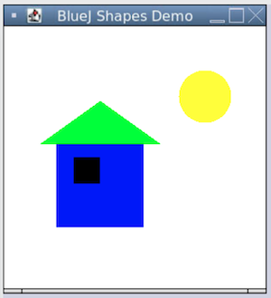

# Dream House

Draw a dream house using objects in Java.

Look at the code in Picture.java and Main.java.

Main.java creates a Picture object from the Picture class, and then it calls the "draw()" method on the object.

Picture's class has a "draw()" method which setups a series of other objects, Squares, Triangles and Circles, and draw each of them in order on a Canvas object.
The Canvas object is the little window that gets displayed with your dream house on it.

This what the starter house looks like:

You can add new objects to the draw() methid and make the picture more detailed. Some students put in trees, lakes and ponds, grass, driveways, and larger more complicated house sections.
